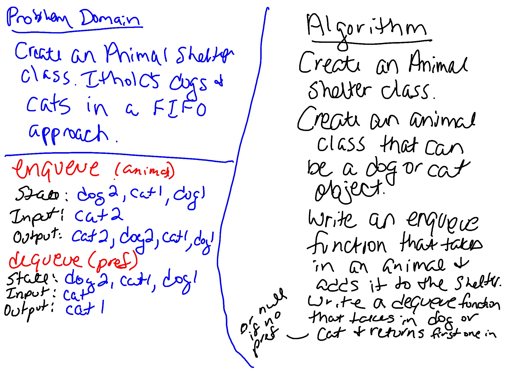

# Fifo Animal Shelter 
Write a class called Animal Shelter that holds only dogs and cats. It operates using a first-in, first-out approach and returns a dog or cat if requested.

## Challenge
Create a class called AnimalShelter which holds only dogs and cats. The shelter operates using a first-in, first-out approach.

Implement the following methods:

- enqueue(animal): adds animal to the shelter. animal can be either a dog or a cat object.

- dequeue(pref): returns either a dog or a cat. If pref is not "dog" or "cat" then return null.

## Approach & Efficiency
Created an Animal class with a constructor. Created an Animal Shelter class with a constructor and two methods. Created tests to verify the functionality. 

`enqueue()` takes in an animal and puts it in the animal shelter (O(1) efficiency). `dequeue()` takes in an animal type and returns the animal in the animal shelter of that type that has been there the longest.

## Whiteboard
