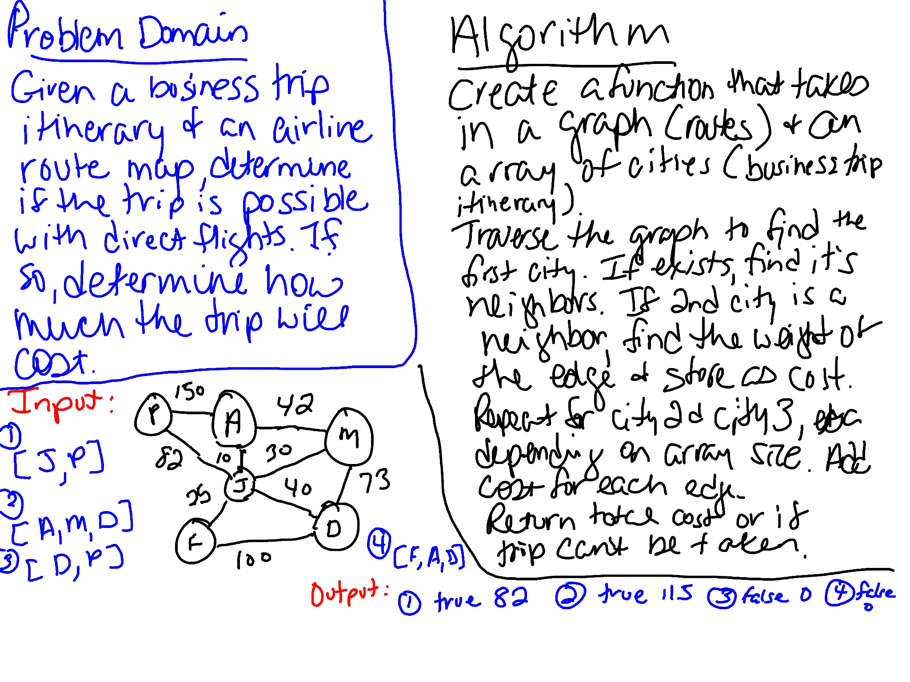

# Graph Get Edge
Given a business trip itinerary, and an Alaska Airlines route map, is the trip possible with direct flights? If so, how much will the total trip cost be?

## Challenge
Write a function which takes in a graph and an array of city names. Without utilizing any of the built-in methods available to your language, return whether the full trip is possible with direct flights, and how much it would cost.

## Approach & Efficiency
Created a function that determines if a trip is possible with direct flights and how much it would cost. Created tests to verify the functionality. 

`verifyTrip` finds the neighbors of the first city in the array. When it finds the node, it checks to see if the next city in the array is one of its neighbors. If so, it gets the weight of the edge between them. If there are more cities in the array, it checks to see if the next city in the array is a neighbor of the second city. If so, it gets the weight of the edge adds it to the previous weight. This continues as long as there are cities in the array. Then you do it again comparing the second city to the first one, the third city (if there is one) to the second one, and so on. This is because our graph is not directional so we need to check both directions. If you can get to all the cities, return true with the total weight value. If you can't get to all of the cities, then return false with 0. This method is O(n2) since it could go through the whole graph twice. `compareNodes` is a function that's called in `verifyTrip` to do the comparisons.

## Whiteboard
