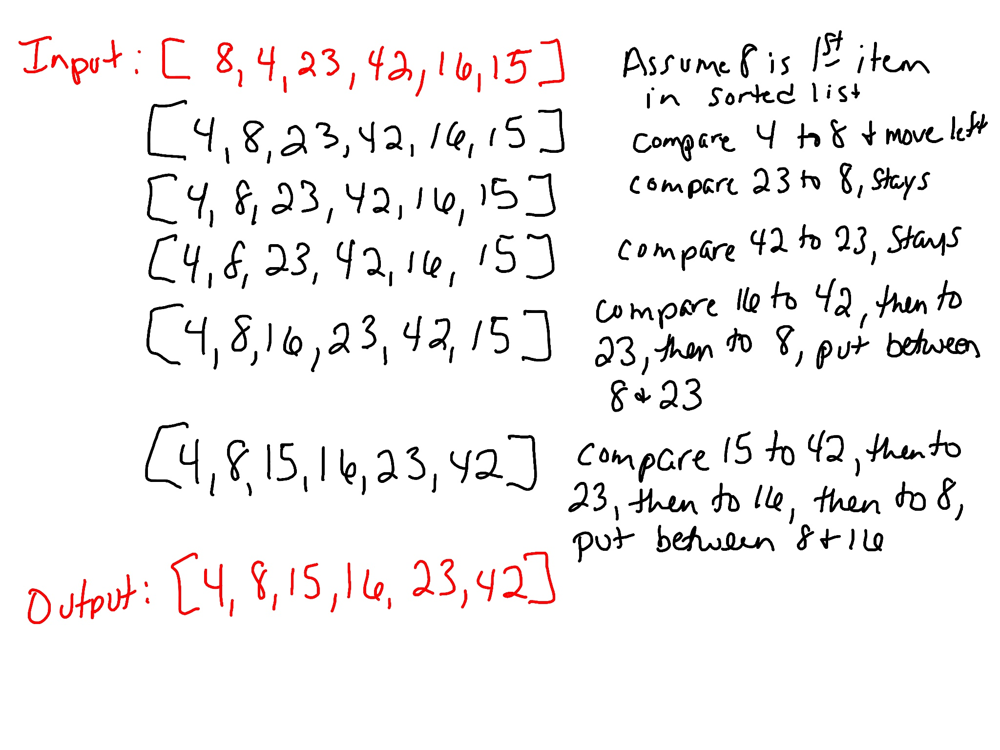

## Insertion Sort

Insertion sort is a comparison sort used for sorting an array (or list). It compares the current value with other values in the same array (or list) that's being sorted to determine where to put it. You move the current value so that the value to its left is less than or equal to its value.

### Pseudo Code 
```
InsertionSort(int[] arr)
  
    FOR i = 1 to arr.length
    
      int j <-- i - 1
      int temp <-- arr[i]
      
      WHILE j >= 0 AND temp < arr[j]
        arr[j + 1] <-- arr[j]
        j <-- j - 1
        
      arr[j + 1] <-- temp
```

### Trace

Sample array: `[8,4,23,42,16,15]`



### Efficiency

Time: This sort runs in O(n^2) time in the worst case.

Space: The array is sorted in place so no additional space is being created. This means the space is O(1).