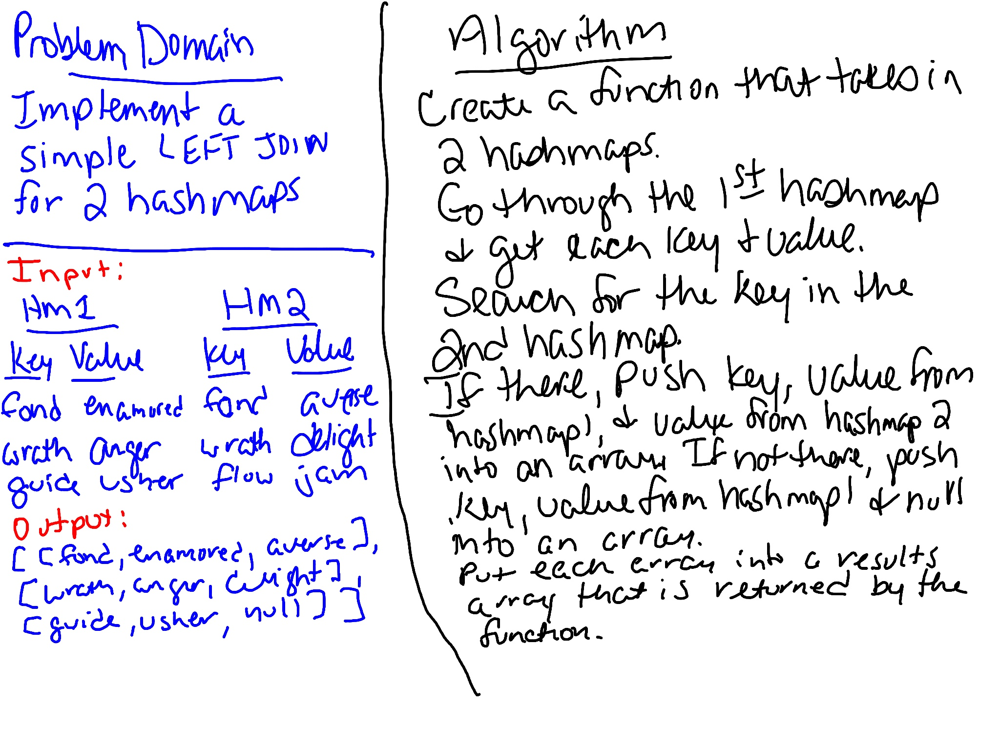

# Left Join
Implement a LEFT JOIN for two Hashmaps.

## Challenge
- Write a function that LEFT JOINs two hashmaps into a single data structure.

- The first parameter is a hashmap that has word strings as keys, and a synonym of the key as values.

- The second parameter is a hashmap that has word strings as keys, and antonyms of the key as values.

- Combine the key and corresponding values (if they exist) into a new data structure according to LEFT JOIN logic.

- LEFT JOIN means all the values in the first hashmap are returned, and if values exist in the “right” hashmap, they are appended to the result row. If no values exist in the right hashmap, then some flavor of NULL should be appended to the result row.

- The returned data structure that holds the results is up to you. It doesn’t need to exactly match the output below, so long as it achieves the LEFT JOIN logic.

- Avoid utilizing any of the library methods available to your language.

## Approach & Efficiency
Create a function that takes in two hashmaps. It goes through the first hashmap and gets each key and value. It searches for that key in the second hashmap. If there, it pushes the key, value from first hashmap, and value from second hashmap into an array. If not there, it pushes the key, value from first hashmap, and `null` into an array. It takes that array and pushes it into a results array that is returned by the function. This has a `O(n)` efficiency because it goes through the whole first hashmap which is `O(n)`, but then just goes to the particular value in the second hashmap which is `O(1)`.

## Whiteboard
