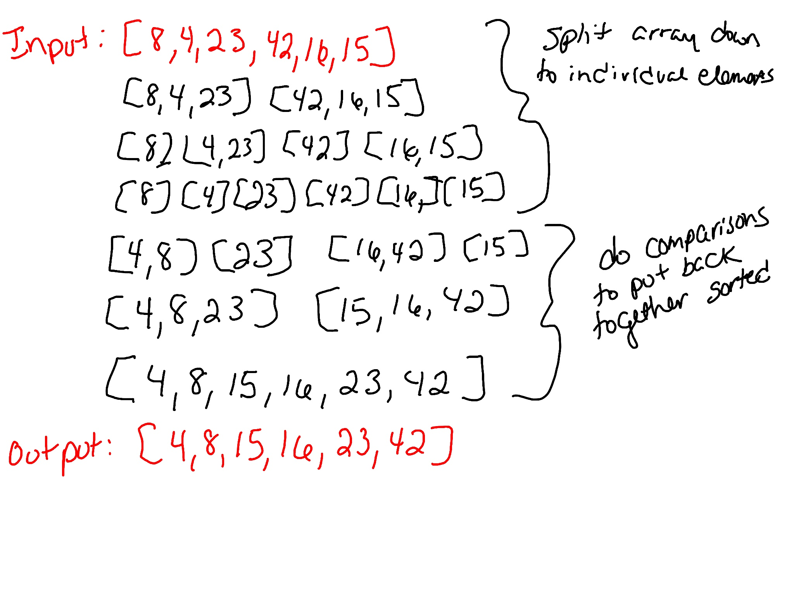

## Merge Sort

Merge sort uses the concept of divide and conquer for sorting an array (or list). It divides a problem into smaller problems. For example, it divides an array (or list) in half and keeps doing so until we have arrays with one element in each of them. Then we start merging and sorting the smaller arrays until we've merged them all into one sorted array. This will use recursion.

### Pseudo Code 
```
ALGORITHM Mergesort(arr)
    DECLARE n <-- arr.length
           
    if n > 1
      DECLARE mid <-- n/2
      DECLARE left <-- arr[0...mid]
      DECLARE right <-- arr[mid...n]
      // sort the left side
      Mergesort(left)
      // sort the right side
      Mergesort(right)
      // merge the sorted left and right sides together
      Merge(left, right, arr)

ALGORITHM Merge(left, right, arr)
    DECLARE i <-- 0
    DECLARE j <-- 0
    DECLARE k <-- 0

    while i < left.length && j < right.length
        if left[i] <= right[j]
            arr[k] <-- left[i]
            i <-- i + 1
        else
            arr[k] <-- right[j]
            j <-- j + 1
            
        k <-- k + 1

    if i = left.length
       set remaining entries in arr to remaining values in right
    else
       set remaining entries in arr to remaining values in left
```

### Trace

Sample array: `[8,4,23,42,16,15]`



### Efficiency

Time: This sort runs in O(n log n) time in the worst case.

Space: The space complexity is O(n) because it does not sort in place.