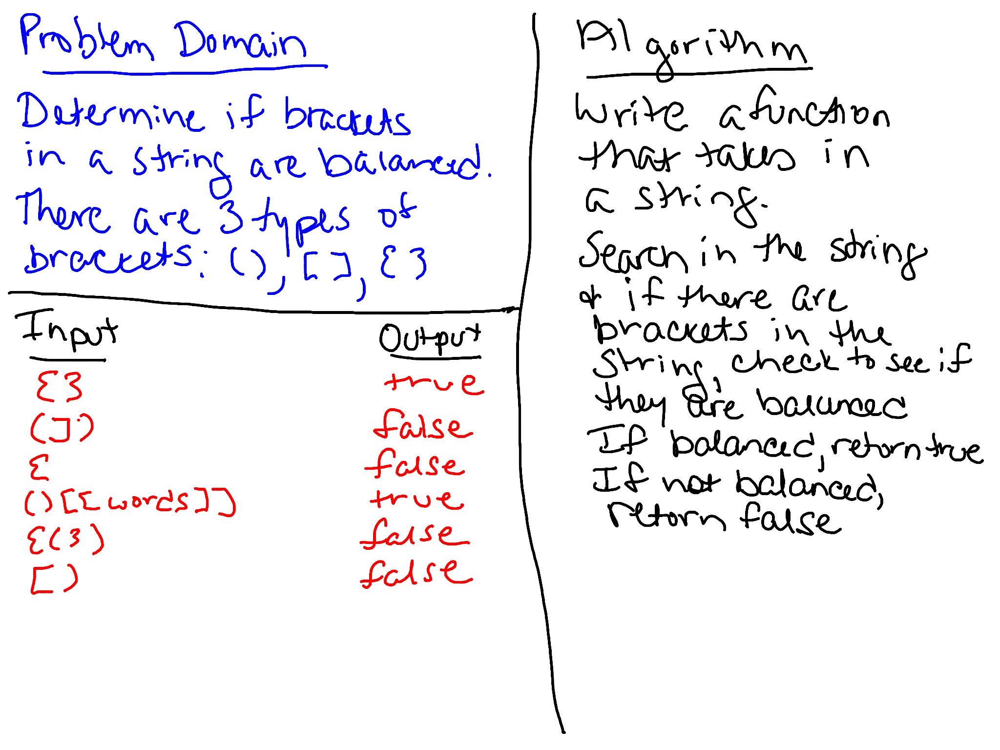

# Multi Bracket Validation
Write a function that takes in a string and verifies if the brackets in the string are balanced.

## Challenge
Write a function called `multiBracketValidation(input)`.

Your function should take a string as its only argument, and should return a boolean representing whether or not the brackets in the string are balanced. There are 3 types of brackets:

Round Brackets : `()`

Square Brackets : `[]`

Curly Brackets : `{}`

## Approach & Efficiency
Inside the multiBracketValidation function which takes in a string:

- Create a character stack array. 
- Remove non-bracket characters from the input string.
- Traverse the string:
  - if the current character is an opening bracket, then push it to the stack array
  - if the current character is a closing bracket, then pop from the stack and if the popped character is the matching starting bracket, then it's fine
  - at the end of the traversal, if an opening bracket is left in the stack, then the string isn't balanced.

[Reference](https://js-algorithms.tutorialhorizon.com/2015/11/16/justify-if-a-string-consists-of-valid-parentheses/)

## Whiteboard
