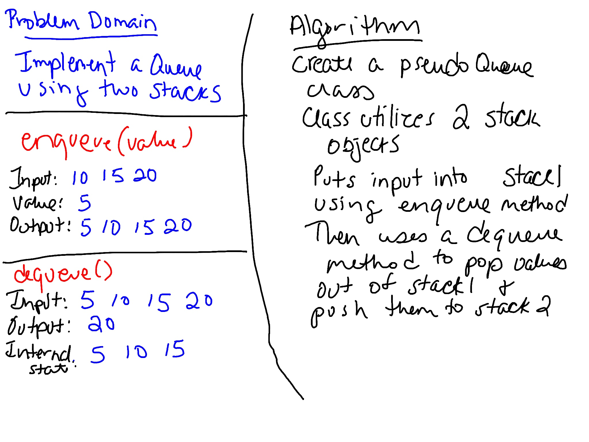

# Queue with Stacks 
Write a class that uses enqueue and dequeue methods utilizing two stack objects.

## Challenge
Create a brand new `PseudoQueue` class. Do not use an existing Queue. Instead, this `PseudoQueue` class will implement our standard queue interface (the two methods listed below), but will internally only utilize 2 `Stack` objects. Ensure that you create your class with the following methods:

- enqueue(value) which inserts value into the PseudoQueue, using a first-in, first-out approach.
- dequeue() which extracts a value from the PseudoQueue, using a first-in, first-out approach.

The `Stack` instances have only `push`, `pop`, and `peek` methods. You should use your own Stack implementation. Instantiate these Stack objects in your PseudoQueue constructor.

## Approach & Efficiency
Created a Stack class. The Stack class has 4 methods. Created a PseudoQueue class. The PseudoQueue class has 2 methods. Created tests to verify the functionality. 

`enqueue()` takes in a value and pushes it to a stack (O(1) efficiency). `dequeue()` pops values from a stack and push them into a new stack so they're in the reverse order. Then it pops the value of the top off and returns it (0(1) efficiency).

## Whiteboard

