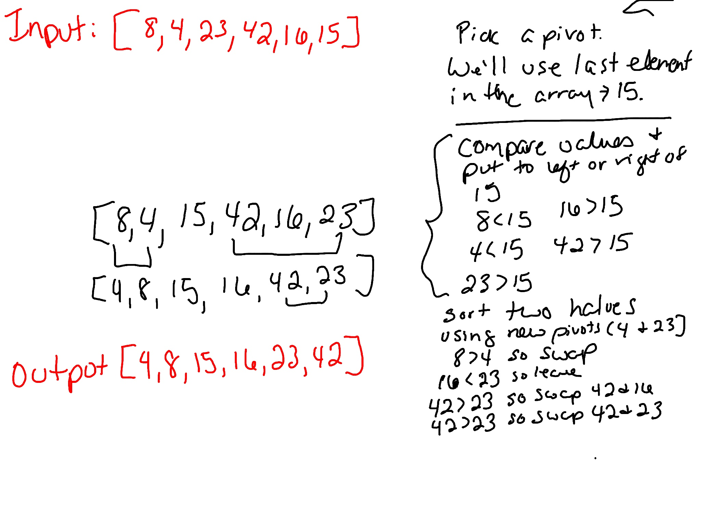

## Quick Sort

Quick Sort sorts an array using a "pivot." It picks an item in the array to be the "pivot." Then it splits all other items into the array into two categories - greater than the pivot or less than the pivot. Then it picks a new pivot for each side of the pivot and repeats the process. This sort uses recursion.

### Pseudo Code 
```
ALGORITHM QuickSort(arr, left, right)
    if left < right
        // Partition the array by setting the position of the pivot value 
        DEFINE position <-- Partition(arr, left, right)
        // Sort the left
        QuickSort(arr, left, position - 1)
        // Sort the right
        QuickSort(arr, position + 1, right)

ALGORITHM Partition(arr, left, right)
    // set a pivot value as a point of reference
    DEFINE pivot <-- arr[right]
    // create a variable to track the largest index of numbers lower than the defined pivot
    DEFINE low <-- left - 1
    for i <- left to right do
        if arr[i] <= pivot
            low++
            Swap(arr, i, low)

     // place the value of the pivot location in the middle.
     // all numbers smaller than the pivot are on the left, larger on the right. 
     Swap(arr, right, low + 1)
    // return the pivot index point
     return low + 1

ALGORITHM Swap(arr, i, low)
    DEFINE temp;
    temp <-- arr[i]
    arr[i] <-- arr[low]
    arr[low] <-- temp
```

### Trace

Sample array: `[8,4,23,42,16,15]`



### Efficiency

Time: This sort runs in O(n log n) time.

Space: The space complexity is O(n) at the worst case. It's O(1) if sorted in place.