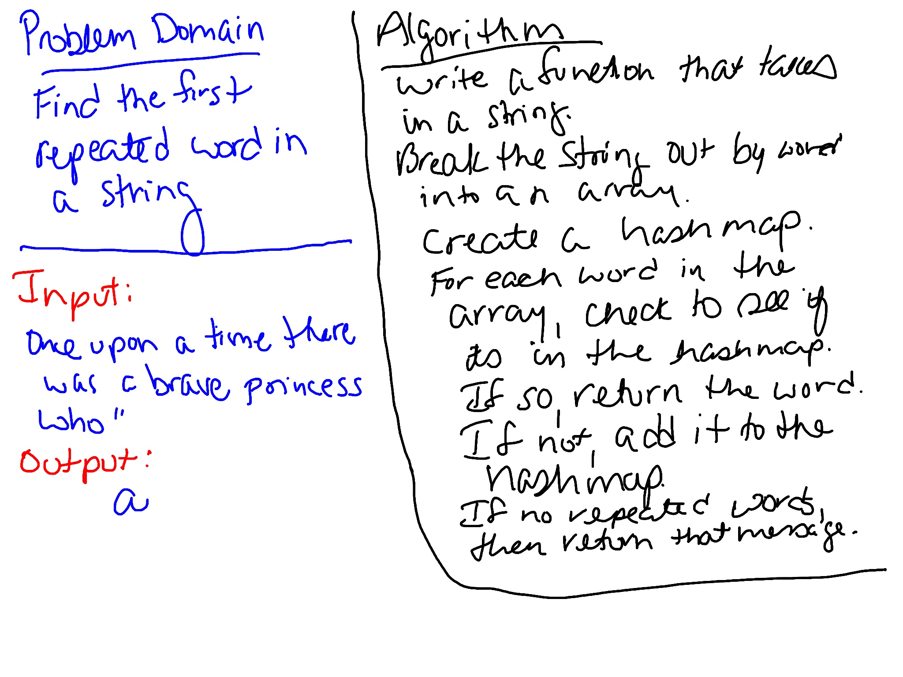

# Repeated Word
Find the first repeated word in a "book"

## Challenge
- Write a function that accepts a lengthy string parameter.

- Without utilizing any of the built-in library methods available to your language, return the first word to occur more than once in that provided string.

## Approach & Efficiency
Created a function that takes in a string. It removes non-letters from the string and puts each word into an array. It creates a hashtable and checks to see if the word is in the table. If not, it adds it. If so, it returns the word. This has a `O(n)` efficiency because it may have to go through every word in the string.

## Whiteboard
