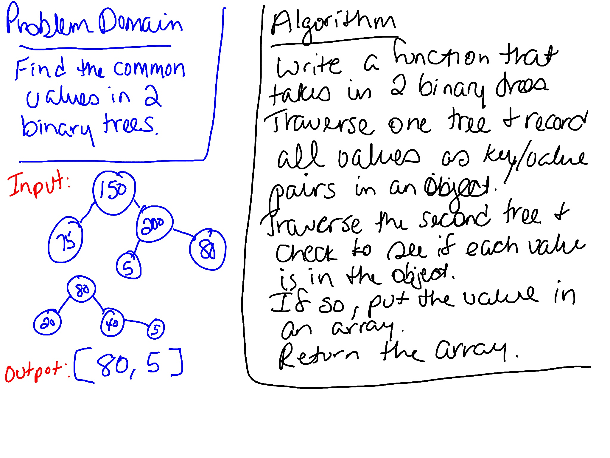

# Tree Intersection
Find the common values in two binary trees.

## Challenge
- Write a function that takes in two binary tree parameters.

- Without utilizing any of the built-in library methods available to your language, return a set of values found in both trees.

## Approach & Efficiency
Created a function that takes in two binary trees. It traverses the first tree and puts each value into an object as a key value pair. It traverses the second tree and checks to see if each value is in the object. If so, it adds it to an array. Then it returns the array. This has a `O(n+m)` efficiency because it has to go through each tree once.

## Whiteboard
