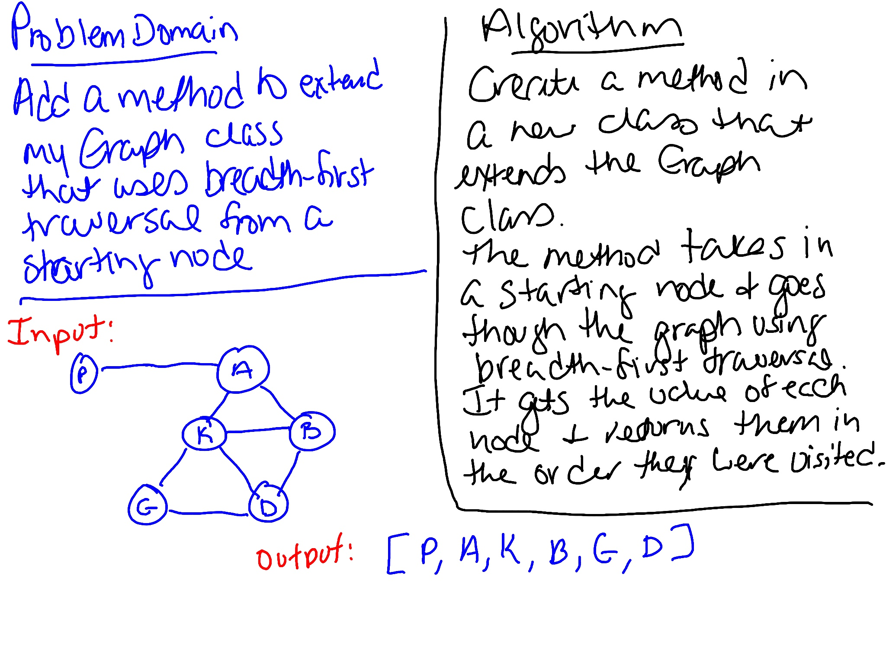

# Graph Breadth First Traversal
Extend the Graph class with a new method that traverses the graph using a breadth first approach and returns a collection of the values as they were encountered.

## Challenge
Extend your graph object with a breadth-first traversal method that accepts a starting node. Without utilizing any of the built-in methods available to your language, return a collection of nodes in the order they were visited. Display the collection.

## Approach & Efficiency
Created a new method that extends the Graph class. Created tests to verify the functionality. 

In the breadthFirst class which extends the Graph class, `traverseBreadthFirst` traverses the graph using a breadth-first approach and returns the values in an array. This method is O(n) since it has to go through the whole graph.

## Whiteboard
