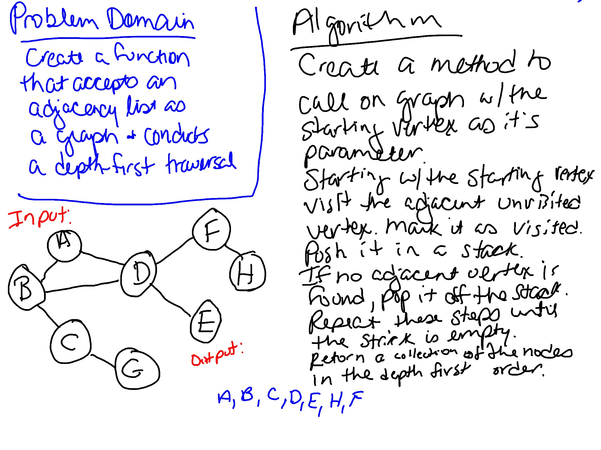

# Graph Depth First Traversal
Write a function that conducts a depth first preorder traversal on a graph.

## Challenge
Create a function that accepts an adjacency list as a graph, and conducts a depth first traversal. Without utilizing any of the built-in methods available to your language, return a collection of nodes in their pre-order depth-first traversal order.

## Approach & Efficiency
Created a function that performs a depth first traversal on a graph. Created tests to verify the functionality. 

`traverseDepthFirst` traverses the graph using a depth-first approach and returns the values in set. This method is O(n) since it has to go through the whole graph.

## Whiteboard
