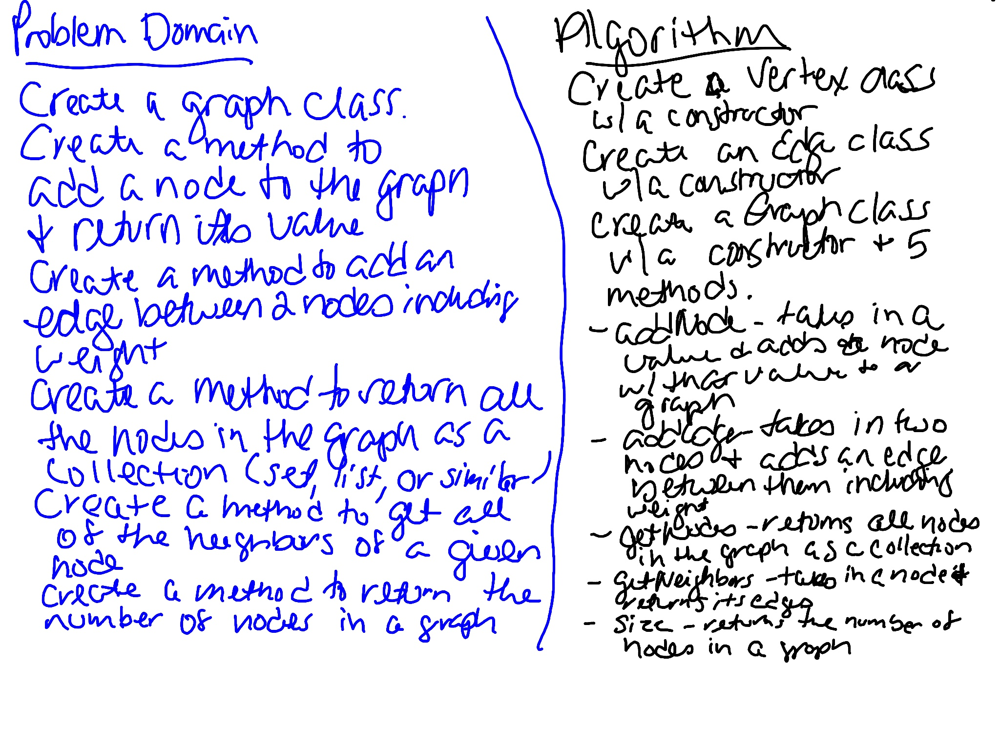

# Graph
Create a Graph class. Create four methods: `addNode`, `addEdge`, `getNodes`, `getNeighbors`, and `size`.

## Challenge
Implement your own Graph. The graph should be represented as an adjacency list, and should include the following methods:

AddNode()

- Adds a new node to the graph

- Takes in the value of that node

- Returns the added node

AddEdge()

- Adds a new edge between two nodes in the graph

- Include the ability to have a “weight”

- Takes in the two nodes to be connected by the edge

- Both nodes should already be in the Graph

GetNodes()

- Returns all of the nodes in the graph as a collection (set, list, or similar)

GetNeighbors()

- Returns a collection of edges connected to the given node

- Takes in a given node

- Include the weight of the connection in the returned collection

Size()

- Returns the total number of nodes in the graph

## Approach & Efficiency
Created a Vertex class with a constructor. Created an Edge class with a constructor. Created a Graph class with a constructor and five methods. Created tests to verify the functionality. 

In the Graph class, `addNode` takes in a value. It adds a new node to the graph with that value and returns the node. This has an efficiency of O(1). `addEdge` takes in two nodes and adds and edge between them. This has an efficiency of O(1). `getNeighbors` takes in node and returns a collection of edges for that node. This has an efficiency of O(1). `getNodes` returns all of the nodes in the graph in an array. This has an efficiency of O(n). `size` returns the number of nodes in the graph. This uses a built-in Map method. It seems like this would have an efficiency of O(n).

## Whiteboard
