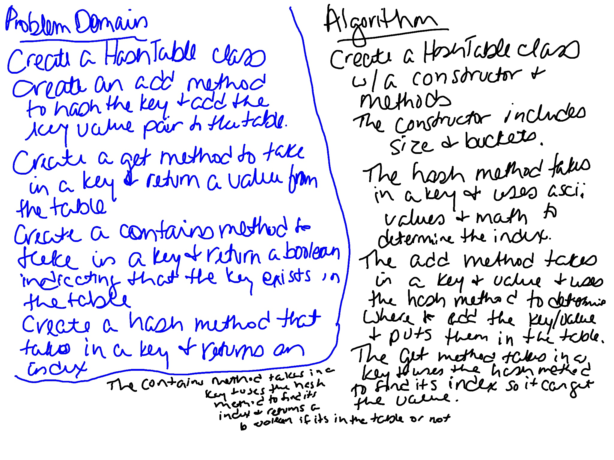

# Hashtable
Create a Hashtable class. Create four methods: `add`, `get`, `contains`, and `hash`.

## Challenge
Implement a Hashtable with the following methods:

- add: takes in both the key and value. This method should hash the key, and add the key and value pair to the table, handling collisions as needed.

- get: takes in the key and returns the value from the table.

- contains: takes in the key and returns a boolean, indicating if the key exists in the table already.

- hash: takes in an arbitrary key and returns an index in the collection.

## Approach & Efficiency
Created a HashTable class with a constructor and four methods. Created tests to verify the functionality. (Copied in Node and LinkedList classes to use with the HashTable class).

In the HashTable class, `hash` takes in a key and uses ascii values and math to determine the index. This has an efficiency of O(n). `add` takes in a key and value and uses the hash method to determine where to put the key/value and put them in the table. This usually has an efficiency of O(1). `get` takes in a key and uses the hash method to find its index so it can get the value. This usually has an efficiency of O(1). `contains` takes in a key and uses the hash method to find its index and then checks to see if its in the table or not and returns a boolean. This usually has an efficiency of O(1).

## Whiteboard
