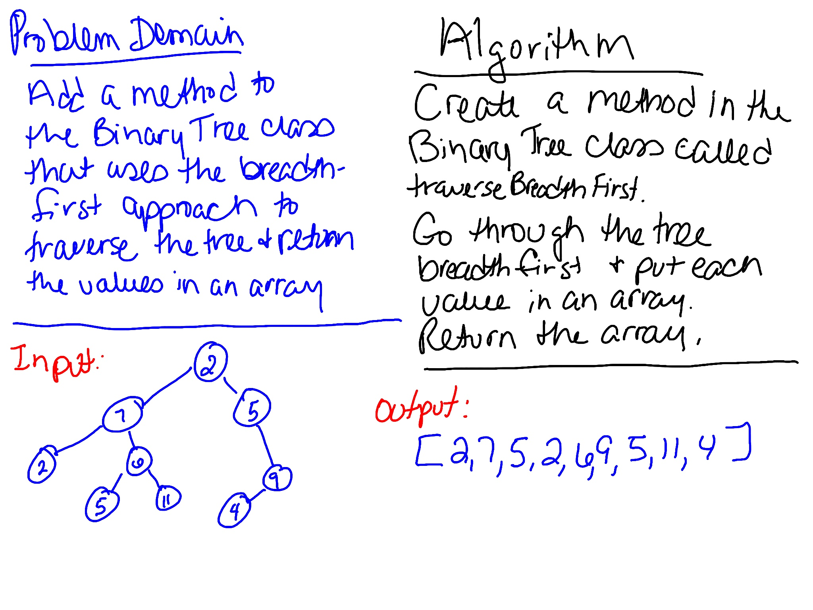

# Binary Tree Breadth First Traversal
Extend the BinaryTree class with a new method that traverses the tree using a breadth first approach and returns a list of values as they were encountered.

## Challenge
Write a breadth first traversal method which takes a Binary Tree as its unique input. Without utilizing any of the built-in methods available to your language, traverse the input tree using a Breadth-first approach, and return a list of the values in the tree in the order they were encountered.

## Approach & Efficiency
Created a new method in the BinaryTree class. Created tests to verify the functionality. 

In the BinaryTree class, `traverseBreadthFirst` traverses the tree using a breadth-first approach and returns the values in an array. This method is O(n) since it has to go through the whole tree.

## Whiteboard
