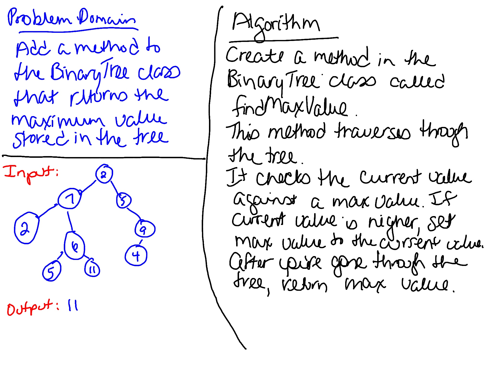

# Find Maximum Binary Tree
Extend the BinaryTree class with a new method that finds the maximum value in the tree.

## Challenge
Write an instance method called `find-maximum-value`. Without utilizing any of the built-in methods available to your language, return the maximum value stored in the tree. You can assume that the values stored in the Binary Tree will be numeric.

## Approach & Efficiency
Created a new method in the BinaryTree class. Created tests to verify the functionality. 

In the BinaryTree class, `findMaxValue` traverses the tree and returns the maximum value stored in the tree. This method is O(n) since it has to go through the whole tree.

## Whiteboard
