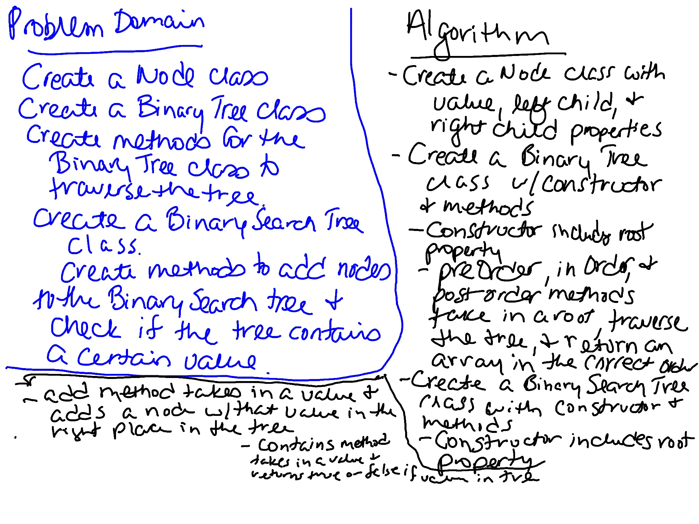

# Trees
Create a Node class. Create a BinaryTree class with three traversal methods: preOrder, postOrder, and inOrder. Create a BinarySearchTree class with two methods: add and contains.

## Challenge
- Create a Node class that has properties for the value stored in the node, the left child node, and the right child node.

- Create a BinaryTree class

  - Define a method for each of the depth first traversals called preOrder, inOrder, and postOrder which returns an array of the values, ordered appropriately.

- Any exceptions or errors that come from your code should be semantic, capturable errors. For example, rather than a default error thrown by your language, your code should raise/throw a custom, semantic error that describes what went wrong in calling the methods you wrote for this lab.

- Create a BinarySearchTree class

  - Define a method named add that accepts a value, and adds a new node with that value in the correct location in the binary search tree.

  - Define a method named contains that accepts a value, and returns a boolean indicating whether or not the value is in the tree at least once.

## Approach & Efficiency
Created a Node class with a constructor. Created a BinaryTree class with a constructor and six methods. Created a BinarySearchTree class with two methods. Created tests to verify the functionality. 

In the BinaryTree class, `preOrder` traverses the tree and returns an array with the values in the correct order. `inOrder` traverses the tree and returns an array with the values in the correct order. `postOrder` traverses the tree and returns an array with the values in the correct order. Each of these methods has a helper function so the results array can be created in the method without the results being cleared out during each time the method is called within the method. These methods are O(n) since they have to go through the whole tree.

In the BinarySearchTree class, `add` takes in a value and puts in in the right location in the tree. This has an efficiency of O(n). `contains` takes in a value and searches the tree to see if it contains that value. This has an efficiency of O(n).

## Whiteboard
